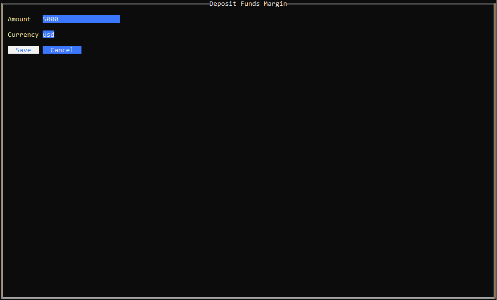

# portfolio-manager

# Overview

Portfolio Manager is a simple terminal-based user interface (UI) application designed to help you manage and track your stock portfolio. Built with Go, this tool offers an intuitive way to view, update, and analyze your investments directly from the terminal.

# Features

- *View Portfolio:* Display a summary of your stock holdings and their current values.
- *Buy/Sell Stocks:* Easily add or remove stocks from your portfolio.
- *Updated Prices:* Stock prices update automatically with a Yahoo Finance API.
- *Analyze Performance:* Get insights into the performance of your investments.

## Screenshots
*Main Menu*

*Portfolio*

*Portfolio 2*

*Buy Stock*

*Sell Stock*

*Portfolio Margin Account*

*Fund Accounts*

*Fund Account Options*

*Fund Account Deposit*

*Fund Account Withdraw*

